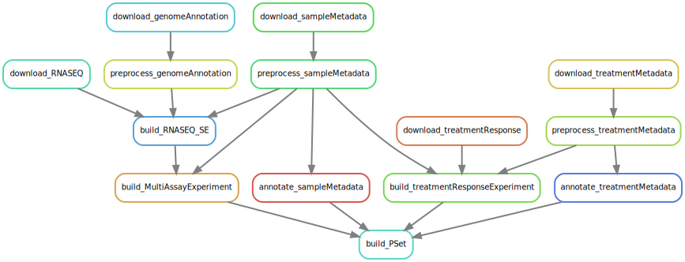
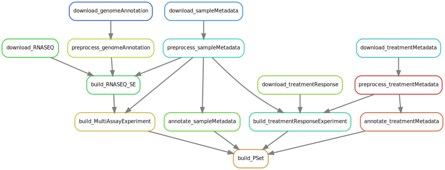
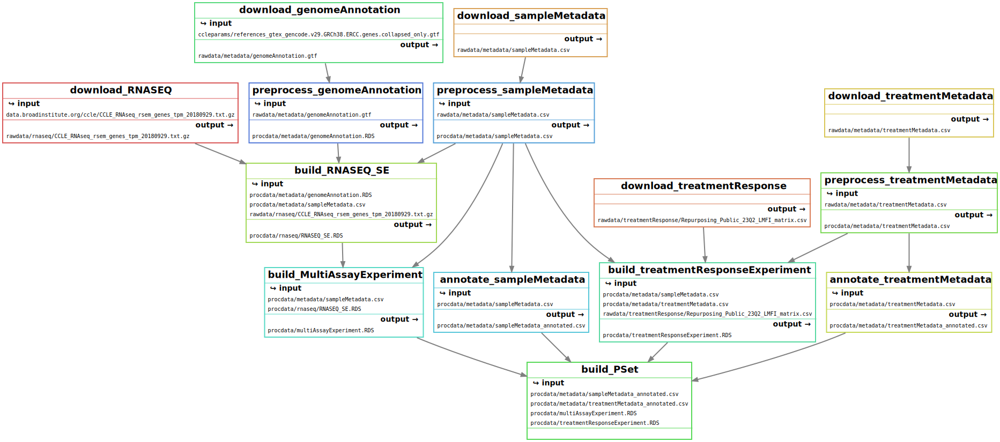

# example-Snakemake_Pipeline

Pipeline should from start to finish cover most of what a user needs to build their pipeline

Minimum requirements:

- [x] Should download a file from HTTP
- [x] Should download a file from GS storage (snakemake 7.32.4)
- [ ] Should use multiple wildcards
- [ ] Should run a python script
- [x] Should run an R script
- [ ] Should run a bash script
- [ ] Should define resources
- [ ] Should use a conda environment (with a post script)
- [ ] Should use a docker container

#### DAG 

#### Rulegraph

#### Filegraph

